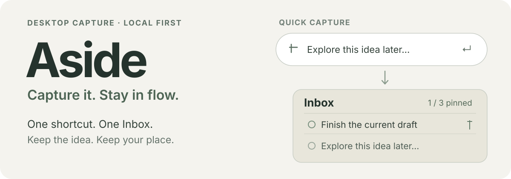

# Aside

[简体中文](README.md) · [English](README.en.md)

<p align="center">
  
</p>

*交互示意，非应用截图。*

你正在处理一件事，另一个想法却突然冒出来。切走去记录，会打断当前任务；不记，又怕它转瞬即逝。Aside 把记录动作缩短为：**按快捷键 → 写一句 → 回到手头的事。**

它是一个轻量桌面 Inbox，不是多窗口便签墙。所有想法进入同一个列表，新记录默认不置顶；只有你选出的最多三条事项会持续留在眼前。记录保存在本机，无需账号、云同步或 AI 服务。

## 快速上手

1. 从 [v1.1.0 Releases](https://github.com/savannahliz/aside/releases/tag/v1.1.0) 下载适合你系统的安装包。源码压缩包不能直接运行。
2. 启动 Aside。在任何应用中按快速记录快捷键，屏幕中央会出现输入条。
3. 输入内容并按 **Enter**：输入条消失，内容进入 Inbox；按 **Esc** 可取消。快捷键和保存键均可在设置中修改。

| 平台 | 下载 | 默认快速记录快捷键 |
| --- | --- | --- |
| macOS 13+ · Apple Silicon / Intel | [下载 DMG](https://github.com/savannahliz/aside/releases/download/v1.1.0/Aside-1.1.0-macOS-universal.dmg) | Option + Space |
| Windows 10/11 · x64 | [下载 EXE](https://github.com/savannahliz/aside/releases/download/v1.1.0/Aside-1.1.0-Windows-x64.exe) | Ctrl + Alt + Space |

Mac：打开 DMG，把 `Aside.app` 拖进“应用程序”；它常驻顶部菜单栏，不显示在 Dock。Windows：双击 `Aside.exe`，无需另装 .NET；应用可从系统托盘找到。

> 安装包目前尚未完成正式代码签名。macOS 首次打开可能被 Gatekeeper 拦截，Windows 也可能显示未知发布者提示。请先核对下载来源；[macOS 的具体操作见下文](#macos-首次打开被拦截)。

## 闪念先放一边，重要的事留在眼前

- **快速捕获**：中央输入条随叫随到，写完即消失。鼠标移入时才显示取消按钮；新事项默认进入普通 Inbox。
- **一个 Inbox，最多三条 Pin**：展开时看全部内容，收起时只看 Pin。置顶第四条时可选择替换对象，原事项仍留在 Inbox。
- **不占满桌面**：完整列表、三条 Pin 和单行细条三种形态；窗口可拖动、缩放、置顶，也可贴到屏幕左右边缘隐藏，靠近边条再唤回。
- **让界面安静下来**：使用系统调色盘选背景色、保存常用颜色，分别调整便签闲置、交互和快速输入时的透明度。
- **事后整理**：完成事项可恢复；“清空”仅删除已完成事项，首次会确认，也可选择以后不再提示。

## 首次打开与升级

### macOS 首次打开被拦截

当前 DMG 未使用 Apple Developer ID 签名和公证。若看到“无法验证 Aside 是否不含恶意软件”，这并不表示系统已检测到恶意软件，也不等于应用已经通过安全审查。**只有在确认文件来自本仓库 Release、且你信任来源时**，才按 [Apple 官方说明](https://support.apple.com/zh-cn/102445) 操作：

1. 在提示框点“完成”，不要点“移到废纸篓”。
2. 打开“系统设置”→“隐私与安全性”，向下滚动到“安全性”。
3. 找到 Aside 的拦截记录，点“仍要打开”，再次确认“打开”。

只将“允许从以下位置下载的应用”改为“App Store 和已识别的开发者”不能代替“仍要打开”。无需关闭 Gatekeeper 或运行终端命令。要从根本上消除首次打开警告，未来版本仍需完成开发者签名和 Apple 公证。

### 从 QuietPin 升级

先退出旧应用，再启动 Aside。为保留记录和设置，内部数据路径与稳定标识没有跟着品牌改名。

- **Mac**：`Aside.app` 不会自动覆盖 `QuietPin.app`。确认原记录在 Aside 中可见后，可自行移除旧应用；不要删除下方的数据目录。
- **Windows**：新程序名为 `Aside.exe`。如果曾开启登录启动，在 Aside 设置中关闭再开启一次，以更新保存的 EXE 路径；Mac 用户也建议重新开启登录启动。

## 数据与边界

| 平台 | 本地记录位置 |
| --- | --- |
| macOS | `~/Library/Application Support/QuietPin/inbox.json` |
| Windows | `%LOCALAPPDATA%\QuietPin\inbox.json` |

路径中的 `QuietPin` 为兼容旧用户数据而保留。Mac 外观和窗口设置由系统 UserDefaults 保存；Windows 设置与记录保存在同一文件。备份前请先退出应用，再复制对应文件。当前没有跨设备同步，Mac 与 Windows 的数据文件也不能直接互相覆盖。

macOS 的数据模型、颜色收藏、窗口形态、贴边行为和快速输入有自动测试。Windows 已通过交叉编译与数据模型测试，**尚未在 Windows 真机验证**界面、全局快捷键、多显示器与登录启动；Intel Mac、全屏应用和多个桌面也未逐一实机验证。

## 从源码构建

macOS 需要 macOS 13+ 与 Xcode Command Line Tools；应用使用 SwiftUI、AppKit 和 Carbon，无第三方代码依赖。

```sh
bash scripts/test-macos.sh
bash scripts/build-macos.sh
```

产物为 `dist/Aside.app` 和通用版 DMG。Windows 需要 .NET 10 SDK，使用 WPF 和 Win32：

```powershell
dotnet run --project windows/Tests/CoreChecks.csproj -c Release
dotnet publish windows/QuietPin.Windows.csproj -c Release -r win-x64 --self-contained true -o dist/windows-x64
```

在 macOS 上也可设置 `DOTNET_BIN` 指向 .NET 10 SDK，然后运行 `bash scripts/build-windows.sh` 交叉编译 Windows 包。

## 反馈与许可

欢迎通过 [Issues](https://github.com/savannahliz/aside/issues) 提交复现步骤、系统版本和截图；分享日志或截图前，请检查其中是否包含私人记录。如果 Aside 对你有帮助，也欢迎给[仓库点个 ⭐](https://github.com/savannahliz/aside)。

Aside 以 [GNU GPL v3.0](LICENSE) 发布（仅第 3 版）。
